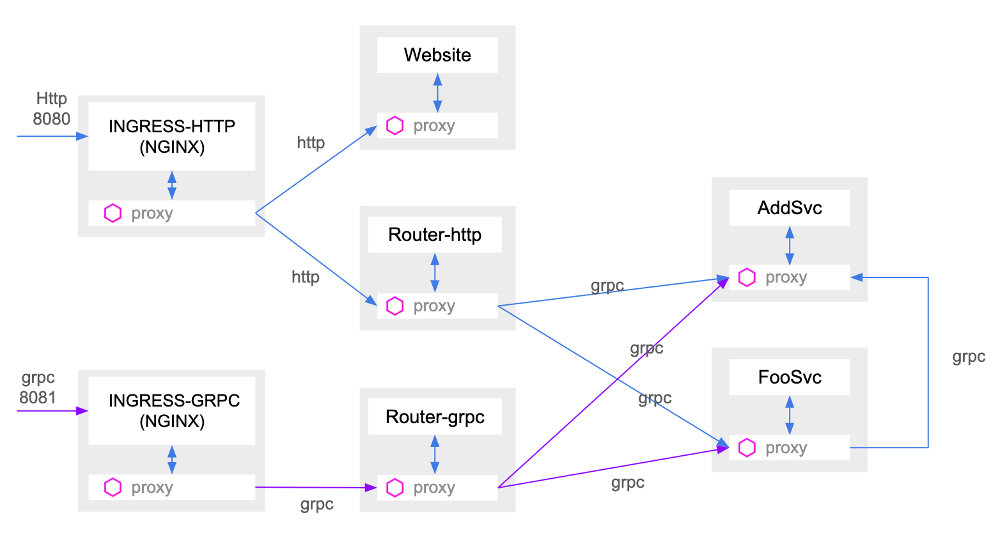
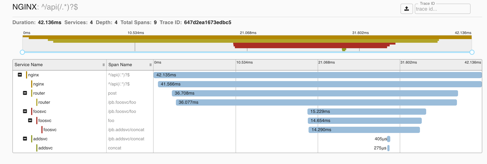

<h1 align="center">Welcome to gokitconsulk8s 👋</h1>
<p>
  <a href="https://github.com/cage1016/gokitconsulk8s/blob/master/LICENSE">
    
  </a>
  <a href="https://twitter.com/CageChung">
    
  </a>
</p>

> build go microservice with consul at kubernetes

## Architecture

The gokitconsulk8s is comprised of 3 micorservice

1. Router
    - http
    - grpc
1. AddSvc
    - sum
    - concat
1. FooSvc
    - foo



## Install

prepare __helm cluster__

```sh
$ cd consul-helm
$ helm list
$ helm install ./ -n cc
...
```

## Usage

```sh
skaffold run
```

## Test

```bash
## gateway 8080 sum
$ curl -X "POST" "http://localhost:8080/api/addsvc/sum" -H 'Content-Type: application/json; charset=utf-8' -d $'{ "a": 3, "b": 34}'
{"rs":37,"err":null}

## gateway 8080 concat
$ curl -X "POST" "http://localhost:8080/api/addsvc/concat" -H 'Content-Type: application/json; charset=utf-8' -d $'{ "a": "3", "b": "34"}'
{"rs":"334","err":null}

$ ## gateway 8080 foo
$ curl -X "POST" "http://localhost:8080/api/foosvc/foo" -H 'Content-Type: application/json; charset=utf-8' -d $'{"s": "3ddd"}'
{"res":"3dddbar","err":null}

$ ## grpc 8081 sum
$ grpcurl -plaintext -proto ./pb/addsvc/addsvc.proto -d '{"a": 3, "b":5}' localhost:8081 pb.Addsvc.Sum
{
  "rs": "8"
}

$ ## grpc 8081 concat
$ grpcurl -plaintext -proto ./pb/addsvc/addsvc.proto -d '{"a": "3", "b":"5"}' localhost:8081 pb.Addsvc.Concat
{
  "rs": "35"
}

$ ## grpc 8081 foo
$ grpcurl -plaintext -proto ./pb/foosvc/foosvc.proto -d '{"s": "foo"}' localhost:8081 pb.Foosvc.Foo
{
  "res": "foobar"
}
```

__zipkin__

visit http://localhost:9411



## Author

👤 **KAI-CHU CHUNG**

* Twitter: [@CageChung](https://twitter.com/CageChung)
* Github: [@cage1016](https://github.com/cage1016)

## 🤝 Contributing

Contributions, issues and feature requests are welcome!<br />Feel free to check [issues page](https://github.com/cage1016/gokitconsulk8s/issues).

## Show your support

Give a ⭐️ if this project helped you!

<a href="https://www.patreon.com/Cage">
  
</a>

## 📝 License

Copyright © 2019 [KAI-CHU CHUNG](https://github.com/cage1016).<br />
This project is [MIT](https://github.com/cage1016/gokitconsulk8s/blob/master/LICENSE) licensed.

***
_This README was generated with ❤️ by [readme-md-generator](https://github.com/kefranabg/readme-md-generator)_